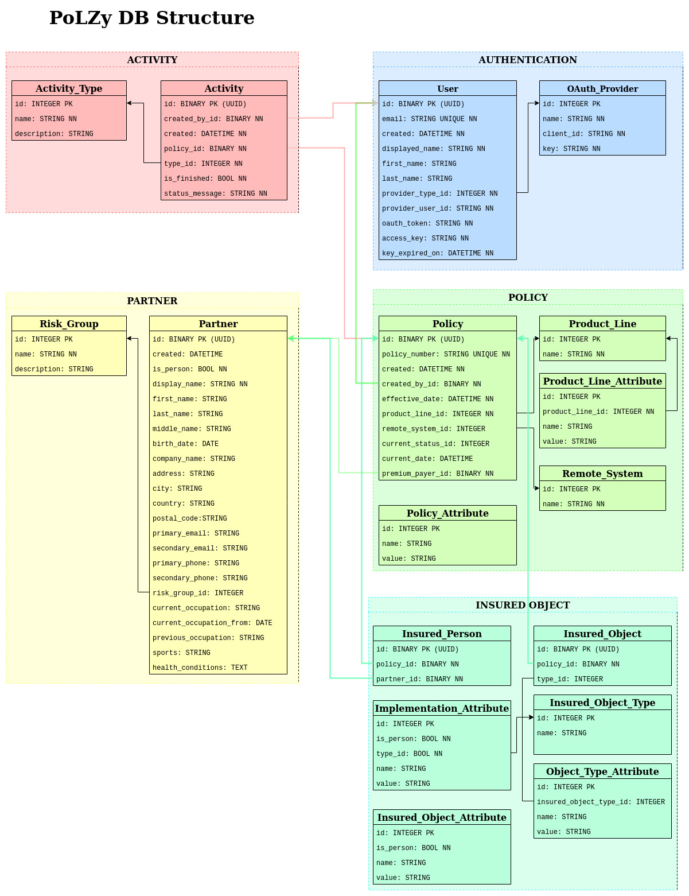

PoLZy Database
==============

Database Structure
------------------
[Editable Source (open with diagrams.net)](https://drive.google.com/file/d/1Rco3Wep9Kzqp2xrR9Ft0G2DvkWvj3iFR/view?usp=sharing)

Description
-----------
The database comprises 5 types of instances. The arrows represent database relationships. All the relationships are `1..n`.

### Authentication

Two tables as shown on the figure above:
* User
* OAuth_Provider

### Policy

Five tables as shown on the figure above:
* Policy
* Product_Line
* Product_Line_Attribute
* Remote_System
* Policy_Attribute

##### Attributes

The `Product_Line` instances are the attributes applied to all the `Policy` instances of a specific Product Line (e.g. Car, Life, P&C, Health).  
The `Policy_Atribute` instances are some kind of global attributes applied to all `Policy` instances.  

### Insured Object

Six tables as shown on the figure above:
* Insured_Person
* Insured_Object
* Insured_Object_Type
* Object_Type_Attribute
* Implementation_Attribute
* Insured_Object_Attribute

##### Attributes

The `Object_Type_Attribute` instances are the attributes applied to all the `Insured_Object` instances of the specified Type (e.g. "House", "Car", "Factory", "Field", "Forest").  
The `Implementation_Attribute` instances are the attributes that depend on the specific PoLZy installation. If field `is_person` is `NOT NULL`, then the attribute relates all `Insured_Person` (`is_person = true`) or `Insured_Object` (`is_person = false`) instances. If field `type_id` is `NOT NULL`, then the attribute relates all the `Insured_Object` instances of the specified Type.  
The `Insured_Object_Atribute` instances are some kind of global attributes applied to all `Insured_Person` (`is_person = true`) or `Insured_Object` (`is_person = false`) instances.  

### Partner

Two tables as shown on the figure above:
* Partner
* Risk Group

### Activity

Two tables as shown on the figure above:
* Activity
* Activity Type