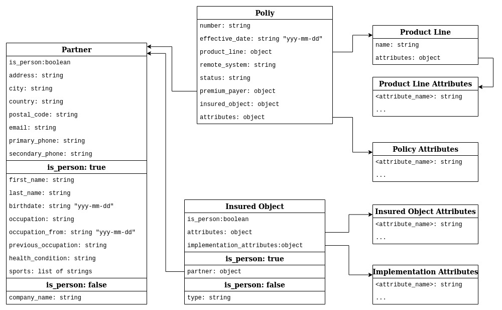

PoLZy Back-End App
==================

[PoLZy](https://gogs.earthsquad.global/athos/PoLZy) is a flexible tool for insurance companies to deal with standard business processes during the life cycle of a policy.  
Here you can find the PoLZy back-end application.

**Currently, it is available only as a development installation**  

Showcase
--------
Without investing too much time when evaluating whether Polzy could be useful for your
organization you can use the Showcase app either on https://polzydemo.buhl-consulting.com.cy/login
or install it from [repository](https://gogs.earthsquad.global/athos/PoLZy_Showcase) locally.

Please see the [Readme](https://gogs.earthsquad.global/athos/PoLZy_Showcase/src/master/README.md)
for detailed instructions about users and available test data.

Custom Elements
---------------
As we mention above, [PoLZy](https://gogs.earthsquad.global/athos/PoLZy) is a flexible system. You may adjust it by your specific environment by developing custom subclasses.  

#### Policy
A policy class is responsible for fetching policy data from Policy Management System and providing it to the front-end app. It inherits class **Policy** from `base.policy` and overrides the following elements:  

##### fetch(policy_number, effective_date)
The method fetches a policy data from the Policy Management System and reshape it to a `JSON` object (*dict*) of structure that is shown in the figure bellow. The reshaped data is stored in `data` property. The method returns `True` if it successful, otherwise - `False`. 
  

##### activities_by_state
Property `activities_by_state` defines the list of possible policy states and available activities for each state:
```python
activities_by_status = {
  'state_1': [
    'activity_1',
    'activity_2',
  ],
  'state_2': []
}
```

##### Policy Attributes
There are several properties that defines policy attribute (see the figure above):
* `attributes_policy` -- policy attributes (dictionary of `<name: description>` records)  
* `attributes_insured_person` -- insured person attributes (corresponds to insured object attributes if `is_person: true` -- dictionary of `<name: description>` records)  
* `attributes_insured_object` -- insured object attributes (corresponds to insured object attributes if `is_person: false` -- dictionary of `<name: description>` records)  
* `attributes_implementation` -- implementation attributes of an insured object (dictionary of `<name: description>` records)
* `attributes_product_line` -- product line attributes (dictionary which keys correspond to the Product Line names and values are dictionary of `<name: description>`)  
* `attributes_insured_object_type` -- insured object type attributes (corresponds to insured object attributes if `is_person: false` -- dictionary which keys correspond to the Insured Object Types and values are dictionary of `<name: description>`)  

#### Activation
Set property `CLASSNAME_POLICY` of the config object to point on the policy class to activate it within current PoLZy implementation.

```python
class Config(object):

    CLASSNAME_POLICY = 'polzy.SamplePolicy'
```

#### Example
Example of policy definition
```python
from base.policy import Policy

class SamplePolicy(Policy):

    # policy statuses with corresponded possible activities 
    activities_by_state = {
        'active': [
            'cancel',
            'suspend',
        ],
        'canceled': [],
        'suspended': [
            're-activate'
        ],
    }

    # policy attribute descriptions
    attributes_policy = {
        'Policy Attribute 1': 'Description of Policy Attribute 1',
        'Policy Attribute 2': 'Description of Policy Attribute 2',
        'Policy Attribute 3': 'Description of Policy Attribute 3',
        'Policy Attribute 4': 'Description of Policy Attribute 4',
    }

    # product line attribute descriptions
    attributes_product_line = {
        'Life': {
            'Life Attribute 1': 'Description of Life Attribute 1',
            'Life Attribute 2': 'Description of Life Attribute 2',
            'Life Attribute 3': 'Description of Life Attribute 3',
        },
        'Health': {
            'Health Attribute 1': 'Description of Health Attribute 1',
            'Health Attribute 2': 'Description of Health Attribute 2',
            'Health Attribute 3': 'Description of Health Attribute 3',
            'Health Attribute 4': 'Description of Health Attribute 4',
            'Health Attribute 5': 'Description of Health Attribute 5',
        },
        'P&C': {
            'P&C Attribute 1': 'Description of P&C Attribute 1',
            'P&C Attribute 2': 'Description of P&C Attribute 2',
        },
        'Car': {
            'Car Attribute 1': 'Description of Car Attribute 1',
        },
    }

    # insured person attribute descriptions
    attributes_insured_person = {
        'Insured Object Attribute 1': 'Description of Insured Object Attribute 1',
        'Insured Object Attribute 2': 'Description of Insured Object Attribute 2',
        'Insured Object Attribute 3': 'Description of Insured Object Attribute 3',
    }

    # insured object attribute descriptions
    attributes_insured_object = {
        'Insured Object Attribute 1': 'Description of Insured Object Attribute 1',
        'Insured Object Attribute 2': 'Description of Insured Object Attribute 2',
        'Insured Object Attribute 3': 'Description of Insured Object Attribute 3',
    }

    # insured object type attribute descriptions
    attributes_insured_object_type = {
        'House': {
            'Hause Attribute 1': 'Description of House Attribute 1',
        },
        'Car': {
            'Car Attribute 1': 'Description of Car Attribute 1',
            'Car Attribute 2': 'Description of Car Attribute 2',
        },
        'Factory': {
            'Factory Attribute 1': 'Description of Factory Attribute 1',
            'Factory Attribute 2': 'Description of Factory Attribute 2',
            'Factory Attribute 3': 'Description of Factory Attribute 3',
        },
        'Field': {
            'Field Attribute 1': 'Description of Field Attribute 1',
            'Field Attribute 2': 'Description of Field Attribute 2',
        },
        'Forest': {
            'Forest Attribute 1': 'Description of Forest Attribute 1',
        },
    }

    # implementation attribute descriptions
    attributes_implementation = {
        'Implementation Attribute 1': 'Description of Implementation Attribute 1',
        'Implementation Attribute 2': 'Description of Implementation Attribute 2',
    }

    def fetch(self):
        # fetch policy data from Policy Management System
        data = policy_system.get(self.number, self.effective_date)
        if data:
            # reshape data if needed
            self.data = data
            return True

        return False
```


Initialization
--------------
First install the dependencies and initiate the database:

```bash
pip install -r requirements.py
flask db init
flask db migrate
flask db upgrade
```

By default, PoLZy uses sqlite3 database `polzy.db` located in the app root folder. You may change that by setting the environmental variable `DATABASE_URL`.  

To migrate database after changing the Value Models, execute:
```bash
flask db migrate
flask db upgrade
```


