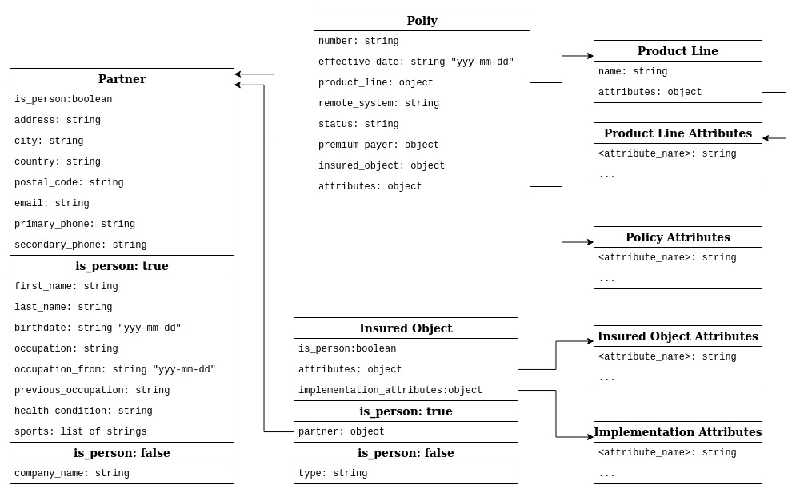

PoLZy Back-End App
==================

[PoLZy](https://gogs.earthsquad.global/athos/PoLZy) is a flexible tool for insurance companies to deal with standard business processes during the life cycle of a policy.  
Here you can find the PoLZy back-end application.

**Currently, it is available only a development installation**  


Custom Elements
---------------
As we mention above, [PoLZy](https://gogs.earthsquad.global/athos/PoLZy) is a flexible system. You may adjust it by your specific environment.  
Visit folder `polzy` to customize PoLZy system. 

#### Interfacing Policy Management System
File `polzy/interface.py` defines the methods to talk to the Policy Management System. Define here the following methods:

##### fetch_policy(policy_number, effective_date)
The method fetches a policy data from the Policy Management System and reshape it to return a `JSON` object (*dict*) as shown in the figure bellow.
 

#### Policy Attributes
File `polzy/attributes.py` defines all the policy attributes (see the figure above). The attributes are:
* policy -- policy attributes (dictionary of `<name: description>` records)  
* insured_person -- insured person attributes (corresponds to insured object attributes if `is_person: true` -- dictionary of `<name: description>` records)  
* insured_object -- insured object attributes (corresponds to insured object attributes if `is_person: false` -- dictionary of `<name: description>` records)  
* implementation -- implementation attributes of an insured object (dictionary of `<name: description>` records)
* product_line -- product line attributes (dictionary which keys correspond to the Product Line names and values are dictionary of `<name: description>`)  
* insured_object_type -- insured object type attributes (corresponds to insured object attributes if `is_person: false` -- dictionary which keys correspond to the Insured Object Types and values are dictionary of `<name: description>`)  

#### Activities
File `polzy/activities.py` defines the list of possible policy states and available activities for each state:
```python
activities_by_status = {
  'state_1': [
    'activity_1',
    'activity_2',
  ],
  'state_2': []
}
```

#### Activity Value Models
File `polzy/models.py` defines the database ORM models that are used to store activity values in PoLZy Database. You can fine the examples of the Activity Value Models in the initial PoLZY installation.


Initialization
--------------
First install the dependencies and initiate the database:

```bash
pip install -r requirements.py
flask db init
flask db migrate
flask db upgrade
```

By default, PoLZy uses sqlite3 database `polzy.db` located in the app root folder. You may change that by setting the environmental variable `DATABASE_URL`.  

To migrate database after changing the Value Models, execute:
```bash
flask db migrate
flask db upgrade
```

To populate database with the sample instances, execute:
```bash
python populate_db.py
```